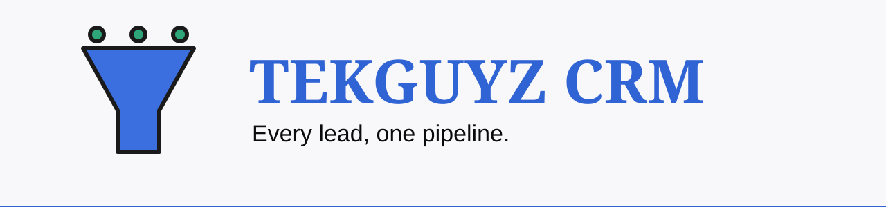
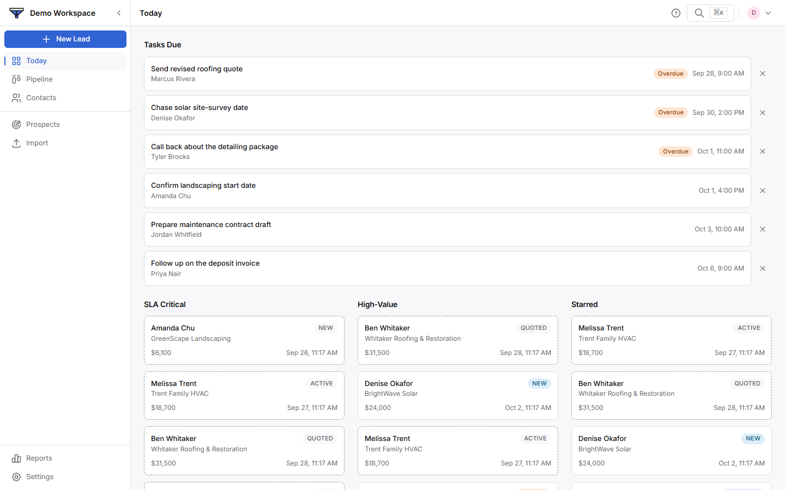
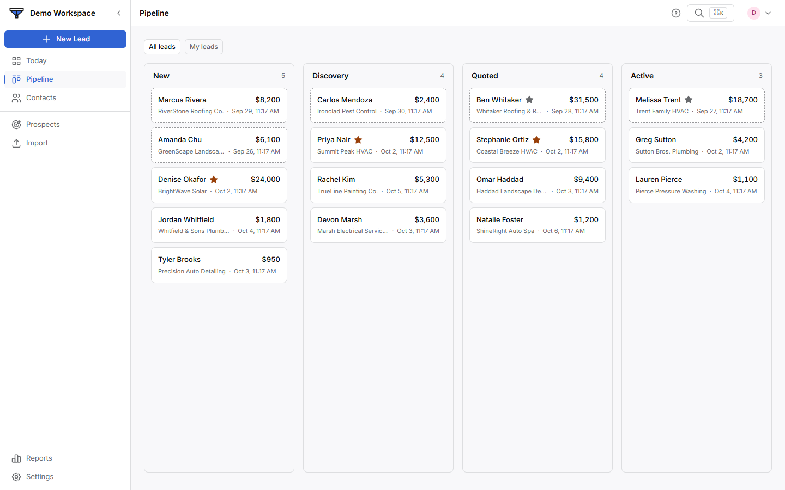

<p align="center"></p>

<p align="center">
  
  
  
  
</p>

**A multi-tenant sales CRM: every lead, one pipeline.**
[Live demo](https://tekguyz-crm.vercel.app) · your own workspace, sample data

## Status

| Row | |
|---|---|
| Phase | In production. Post-launch feature work. |
| Shipped | Leads and pipeline, tasks, contacts, reports, team roles, command palette. Muse Lead Pack import: email optional, WhatsApp, duplicates matched on any channel (#37). Demo: each Guest gets their own writable Demo Org (#31). Landing Page at `/` (#32). Old read-only demo retired and its role dropped, showcase screenshots in `showcase/` (#33). |
| Next | See `docs/INITIATIVES.md`. |
| Updated | 2026-10-01 |

## Screenshots

<p align="center">
  
  
</p>

## What it does

- Tracks each lead from first enquiry to won, lost or abandoned.
- Takes leads from the tekguyz.com form over a signed webhook.
- Imports the weekly Lead Pack CSV. Email is optional; a lead needs one way to
  reach it. A row that matches a lead on any channel is skipped.
- Flags leads that go cold, and keeps tasks and follow-ups.
- Reports by period, with CSV export.
- Has team roles (owner, admin, member) and per-lead owners.
- Searches everything with a command palette.
- Offers a public demo: one press gives each visitor their own writable
  copy with sample data.

## What it never does

- It never hard-deletes a lead. Removal means `archived`.
- It never lets automation hide a lead. A classifier routes a lead only.
- It never estimates revenue. A human sets the outcome.
- It never opens signup. Accounts are invite-only.
- Tenant isolation is Postgres RLS, not app code.

## Stack

| Layer | Choice |
|---|---|
| App | Next.js 15 (App Router), React 19, TypeScript |
| Styling | Tailwind 4, Radix primitives |
| Database and auth | Supabase (Postgres, RLS, Vault) |
| Rate limits | Upstash Redis |
| Email and AI | Resend, Gemini |
| Hosting | Vercel. `main` deploys on push. |

## Run it locally

You need Node 20 or newer and a Supabase project.

```bash
npm ci
npm run dev
```

Copy your values into `.env.local`. The app stops at boot if one is missing.

| Variable | Where it comes from |
|---|---|
| `NEXT_PUBLIC_SUPABASE_URL`, `NEXT_PUBLIC_SUPABASE_PUBLISHABLE_KEY`, `SUPABASE_SECRET_KEY` | Supabase project settings |
| `PLATFORM_GEMINI_API_KEY` | Google AI Studio |
| `PLATFORM_RESEND_API_KEY` | Resend |
| `CRON_SECRET` | Any long random string |
| `NEXT_PUBLIC_APP_URL` | `http://localhost:3000` locally |
| `UPSTASH_REDIS_REST_URL`, `UPSTASH_REDIS_REST_TOKEN` | Upstash. The demo's hourly caps need it; without it "Try the demo" says busy. |

Never commit `.env` files. Secrets live in `.env.local` and in Vercel.
In development, `GET /api/dev-login` signs in a test account.

Database changes go out with `npm run db:push`. It connects with
`SUPABASE_DB_URL` from `.env`, so it needs no Supabase token. Any other
database command: `npm run supabase -- <command> --linked`.

## Tests

```bash
npm run test:unit
npm run test:integration
```

Never `npm test`. It stops on purpose. `test:integration` needs `.env`, changes a real database, and runs one file at a time. CI runs `typecheck`, `test:unit` and `build` on every PR.

## Docs

- [`PRODUCT.md`](PRODUCT.md) — users, purpose, principles
- [`DESIGN.md`](DESIGN.md) — design system
- [`CLAUDE.md`](CLAUDE.md) — permanent build rules
- [`docs/SCHEMA_REFERENCE.md`](docs/SCHEMA_REFERENCE.md) — live schema
- [`docs/SECURITY_MODEL.md`](docs/SECURITY_MODEL.md) — the seven security rules
- [`docs/INITIATIVES.md`](docs/INITIATIVES.md) — feature status
- [`docs/ROADMAP.md`](docs/ROADMAP.md) and [`docs/KNOWN_GAPS.md`](docs/KNOWN_GAPS.md) — what is next and what is deferred

---

<p align="center"><sub>Built by <a href="https://tekguyz.com">TEKGUYZ</a></sub></p>
